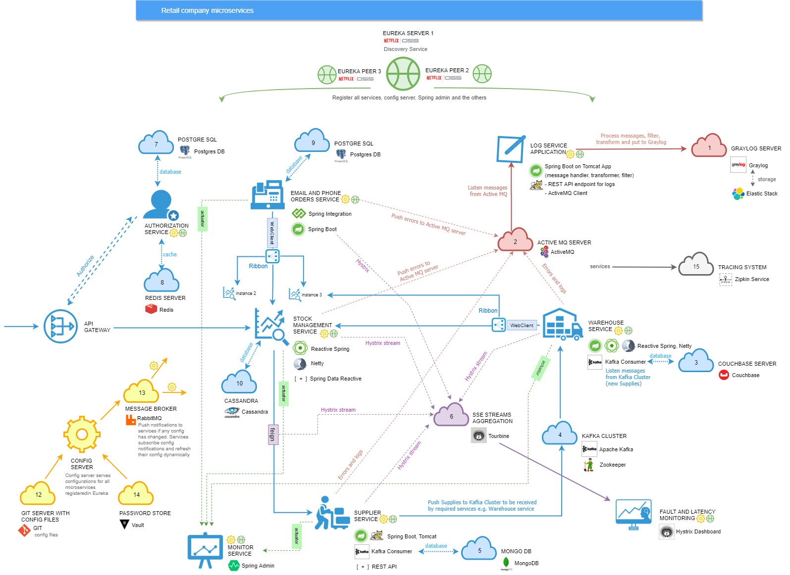
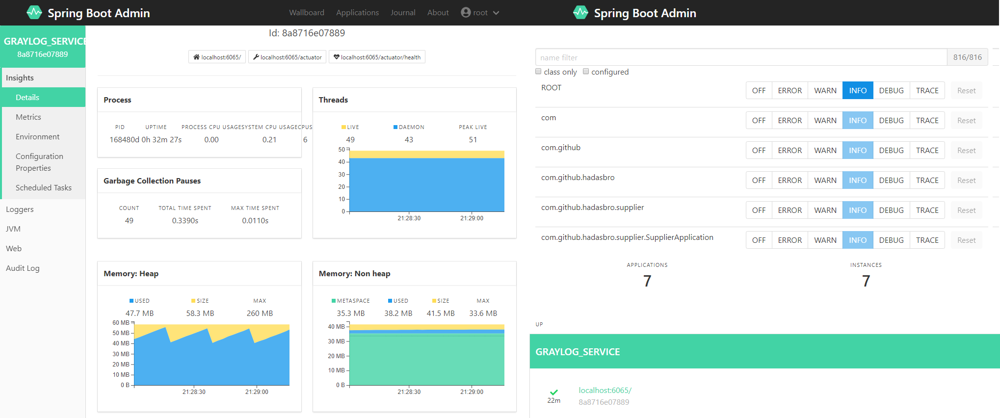
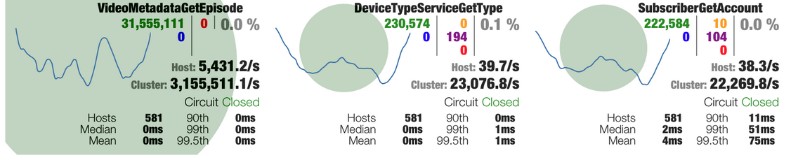
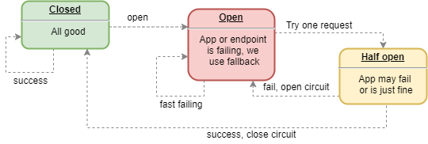
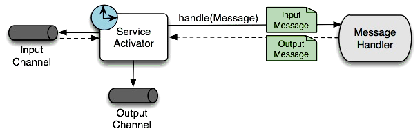
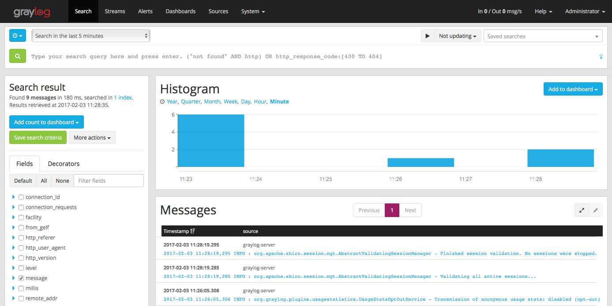
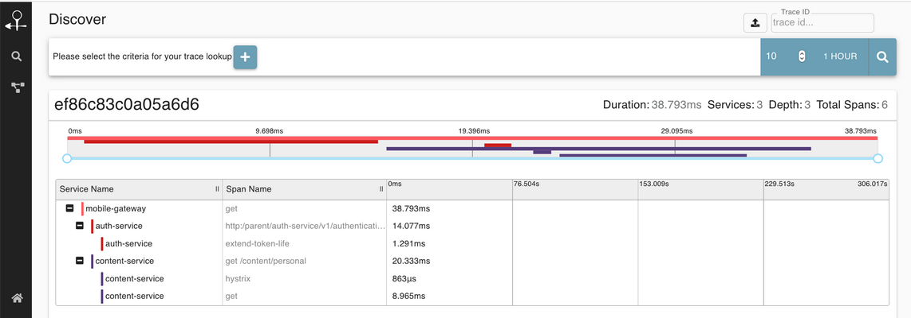

## Microservices

This is just Microservices Architecture sample. 

### Services
| Module                                              		| Service    						| Port | Description                                                                                                                       |
| ---------------------------------------------------- 		| ------------- 					| ---- | ----------------------------------------------------------------------- |
| [ActiveMQ Broker](./activemq_broker/README.md)      		| ActiveMQ            				| 8161 | ActiveMQ on Docker|
| [Couchbase DB](./couchbase_db/README.md)      			| Couchbase            				| 8091 | Couchbase on Docker|
| [Cassandra](./docker_cassandra/README.md)      			| Cassandra            				| 9042 | Cassandra on Docker|
| [Mongo DB](./mongo_docker/README.md)      				| Mongo DB            				| 11017 | MongoDB on Docker |
| [Email Orders Service](./email_order_service/README.md)  	| Spring Integration + PostgreSQL + Tomcat 	| 6061 |  Email Orders service based on Spring Integration|
| [Graylog Service](./graylog_service/README.md)   			| Graylog + ElasticSearch + ActiveMQ + MongoDB | 6065 |  Centralized log service |
| [Kafka Docker](./kafka_docker/README.md)  				| Kafka on Docker       			| 32770 | Kafka and Zookeeper on Docker                   |
| [Postgres DB](./postgres_db/README.md) 					| Postgre SQL  						| 5432 | PostgreSQL's on Docker  |
| [Redis Docker](./redis_docker/README.md) 					| Redis		 						| 6379 | Redis on Docker |
| [Stock Service](./stock_service/README.md)  				| Reactive Spring + Cassandra + Netty | 6063 | Manages stock, supplies, orders and email orders  |
| [Warehouse Service](./warehouse_service/README.md)		| Spring REST + Kafka Consumer + Couchbase	| 6064 | Stores and manages supplies, products, provides supplies to `Stock Service` |
| [Supplier Service](./supplier_service/README.md) 			| Spring REST + Kafka Producer + MongoDB | 6062 | Handles supply-orders from `Stock Service` and provide ordered products to `Warehouse Service` |
| [Service Registry](./eureka/README.md) 					| Eureka 							| 8761, 8762, 8763 | Eureka - Service Registry |
| [Test Service](./test_service/README.md) 					| Spring Boot 						| 1999 	| Test service |
| [Admin](./spring_admin/README.md) 						| Spring Boot Admin 				| 65505 | App adminitration |
| [Hystrix panel](./hystrix_panel/README.md) 				| Spring Boot 						| 8015 	| Hystrix Dashboard |
| [Turbine](./turbine/README.md) 							| Turbine 							| 8902 	| SSE streams aggregation server |
| [Zipkin](./zipkin/README.md) 							    | Zipkin 							| 9411 	| Investigate system's behaviour and traces |

### Useful things
#### Spring Boot Admin
It is a web application, used for managing and monitoring Spring Boot applications. You should
see all services except `Email Order Service` (todo).

see https://github.com/codecentric/spring-boot-admin

#### Hystrix dashboard
Monitoring hystrix metrics.

see https://github.com/Netflix-Skunkworks/hystrix-dashboard

#### Hystrix circuit breaker
Defending app from potentially failing method calls.

see https://github.com/Netflix/Hystrix/wiki/How-it-Works

#### Spring integration
Open source framework for enterprise application integration.

see https://spring.io/projects/spring-integration

#### GrayLog
App logs and monitoring.

see https://www.graylog.org/

#### Zipkin
Distributed tracing system

see https://zipkin.io/

### Find out more
<table cellpadding="2" cellspacing="0" border="0">
    <tr>
        <td>
            <table cellpadding="2" cellspacing="0" border="0">
                <tr>
                    <td height="42" width="65" valign="middle"
                        align="right">
                    </td>
                    <td valign="middle" align="left">
                        <a href="https://activemq.apache.org/">Apache ActiveMQ</a> - JMS client
                    </td>
                </tr>
            </table>
        </td>
        <td>
            <table cellpadding="2" cellspacing="0" border="0">
                <tr>
                    <td height="42" width="65" valign="middle"
                        align="right"></td>
                    <td valign="middle" align="left">
                        <a href="https://www.postgresql.org/">PostgreSQL</a> - RDBMS
                    </td>
                </tr>
            </table>
        </td>
        <td>
            <table cellpadding="2" cellspacing="0" border="0">
                <tr>
                    <td cellpadding="2" height="42" width="65" valign="middle"
                        align="right"></td>
                    <td valign="middle" align="left">
                        <a href="https://spring.io/projects/spring-integration">Spring Integration</a> - Integrating
                        services with Spring
                    </td>
                </tr>
            </table>
        </td>
    </tr>
    <tr>
        <td>
            <table cellpadding="2" cellspacing="0" border="0">
                <tr>
                    <td cellpadding="2" height="42" width="65" valign="middle"
                        align="right"></td>
                    <td valign="middle" align="left">
                        <a href="https://www.graylog.org/">Graylog</a> - Centralized log management system
                    </td>
                </tr>
            </table>
        </td>
        <td>
            <table cellpadding="2" cellspacing="0" border="0">
                <tr>
                    <td cellpadding="2" height="42"  width="65" valign="middle"
                        align="right"></td>
                    <td valign="middle" align="left">
                        <a href="https://www.mongodb.com/">MongoDB</a> - NoSQL Database
                    </td>
                </tr>
            </table>
        </td>
        <td>
            <table cellpadding="2" cellspacing="0" border="0">
                <tr>
                    <td cellpadding="2" height="42"  width="65" valign="middle"
                        align="right"></td>
                    <td valign="middle" align="left">
                        <a href="https://www.elastic.co/products/elasticsearch">Elasticsearch</a> - used as Storage
                        system for GrayLog
                    </td>
                </tr>
            </table>
        </td>
    </tr>
    <tr>
        <td>
            <table cellpadding="2" cellspacing="0" border="0">
                <tr>
                    <td cellpadding="2" height="42"  width="65" valign="middle"
                        align="right"></td>
                    <td valign="middle" align="left">
                        <a href="https://kafka.apache.org/">Apache Kafka</a> - Message broker
                    </td>
                </tr>
            </table>
        </td>
        <td>
            <table cellpadding="2" cellspacing="0" border="0">
                <tr>
                    <td cellpadding="2" height="42"  width="65" valign="middle"
                        align="right"></td>
                    <td valign="middle" align="left">
                        <a href="https://zookeeper.apache.org/">Apache Zookeeper</a> - Synchronization service for kafka
                    </td>
                </tr>
            </table>
        </td>
        <td>
            <table cellpadding="2" cellspacing="0" border="0">
                <tr>
                    <td cellpadding="2" height="42"  width="65" valign="middle"
                        align="right"></td>
                    <td valign="middle" align="left">
                        <a href="https://www.docker.com/">Docker</a> - OS level virtualization
                    </td>
                </tr>
            </table>
        </td>
    </tr>
    <tr>
        <td>
            <table cellpadding="2" cellspacing="0" border="0">
                <tr>
                    <td cellpadding="2" height="42"  width="65" valign="middle"
                        align="right"></td>
                    <td valign="middle" align="left">
                        <a href="https://docs.spring.io/spring/docs/current/spring-framework-reference/web-reactive.html">Reactive
                            Spring</a> - Reactive programming in Spring
                    </td>
                </tr>
            </table>
        </td>
        <td>
            <table cellpadding="2" cellspacing="0" border="0">
                <tr>
                    <td cellpadding="2" height="42"  width="65" valign="middle"
                        align="right"></td>
                    <td valign="middle" align="left">
                        <a href="https://www.baeldung.com/spring-webflux">Spring WebFlux</a> - Reactive programming
                        support for web apps
                    </td>
                </tr>
            </table>
        </td>
        <td>
            <table cellpadding="2" cellspacing="0" border="0">
                <tr>
                    <td cellpadding="2" height="42"  width="65" valign="middle"
                        align="right"></td>
                    <td valign="middle" align="left">
                        <a href="https://netty.io/">Netty</a> - Web Server
                    </td>
                </tr>
            </table>
        </td>
    </tr>
    <tr>
        <td>
            <table cellpadding="2" cellspacing="0" border="0">
                <tr>
                    <td cellpadding="2" height="42"  width="65" valign="middle"
                        align="right"></td>
                    <td valign="middle" align="left">
                        <a href="http://tomcat.apache.org/">Tomcat</a> - Web Server
                    </td>
                </tr>
            </table>
        </td>
        <td>
            <table cellpadding="2" cellspacing="0" border="0">
                <tr>
                    <td cellpadding="2" height="42"  width="65" valign="middle"
                        align="right"></td>
                    <td valign="middle" align="left">
                        <a href="http://cassandra.apache.org/">Apache Cassandra</a> - NoSQL Database
                    </td>
                </tr>
            </table>
        </td>
        <td>
            <table cellpadding="2" cellspacing="0" border="0">
                <tr>
                    <td cellpadding="2" height="42"  width="65" valign="middle"
                        align="right"></td>
                    <td valign="middle" align="left">
                        <a href="https://github.com/OpenFeign/feign">Open Feign</a> - Java HTTP client
                    </td>
                </tr>
            </table>
        </td>
    </tr>
    <tr>
        <td>
            <table cellpadding="2" cellspacing="0" border="0">
                <tr>
                    <td cellpadding="2" height="42"  width="65" valign="middle"
                        align="right"></td>
                    <td valign="middle" align="left">
                        <a href="https://github.com/Netflix/zuul">Zuul</a> - L7 application gateway
                    </td>
                </tr>
            </table>
        </td>
        <td>
            <table cellpadding="2" cellspacing="0" border="0">
                <tr>
                    <td cellpadding="2" height="42"  width="65" valign="middle"
                        align="right"></td>
                    <td valign="middle" align="left">
                        <a href="https://redis.io/">Redis</a> - Cache server, NoSQL Database
                    </td>
                </tr>
            </table>
        </td>
        <td>
            <table cellpadding="2" cellspacing="0" border="0">
                <tr>
                    <td cellpadding="2" height="42"  width="65" valign="middle"
                        align="right"></td>
                    <td valign="middle" align="left">
                        <a href="https://www.couchbase.com/">Couchbase</a> - NoSQL Database
                    </td>
                </tr>
            </table>
        </td>
    </tr>
    <tr>
        <td>
            <table cellpadding="2" cellspacing="0" border="0">
                <tr>
                    <td cellpadding="2" height="42"  width="65" valign="middle"
                        align="right"></td>
                    <td valign="middle" align="left">
                        <a href="https://hibernate.org/">Hibernate</a> - ORM
                    </td>
                </tr>
            </table>
        </td>
        <td>
            <table cellpadding="2" cellspacing="0" border="0">
                <tr>
                    <td cellpadding="2" height="42"  width="65" valign="middle"
                        align="right"></td>
                    <td valign="middle" align="left">
                        <a href="https://zipkin.io/">Zipkin</a> - Distributed tracing system
                    </td>
                </tr>
            </table>
        </td>
        <td>
            <table cellpadding="2" cellspacing="0" border="0">
                <tr>
                    <td cellpadding="2" height="42"  width="65" valign="middle"
                        align="right"></td>
                    <td valign="middle" align="left">
                        <a href="https://docs.spring.io/spring-boot/docs/current/reference/html/production-ready-features.html">Spring
                            actuator</a> - App monitoring
                    </td>
                </tr>
            </table>
        </td>
    </tr>
    <tr>
        <td>
            <table cellpadding="2" cellspacing="0" border="0">
                <tr>
                    <td cellpadding="2" height="42"  width="65" valign="middle"
                        align="right"></td>
                    <td valign="middle" align="left">
                        <a href="https://github.com/codecentric/spring-boot-admin">Spring Admin</a> - Spring Projects
                        Administration
                    </td>
                </tr>
            </table>
        </td>
        <td>
            <table cellpadding="2" cellspacing="0" border="0">
                <tr>
                    <td cellpadding="2" height="42"  width="65" valign="middle"
                        align="right"></td>
                    <td valign="middle" align="left">
                        <a href="https://github.com/Netflix/eureka">Netflix Eureka</a> - Services Regisrty
                    </td>
                </tr>
            </table>
        </td>
        <td>
            <table cellpadding="2" cellspacing="0" border="0">
                <tr>
                    <td cellpadding="2" height="42"  width="65" valign="middle"
                        align="right"></td>
                    <td valign="middle" align="left">
                        <a href="https://github.com/Netflix/Hystrix">Hystrix + Tourbine</a> - Circuit breakers + Hystrix
                        Streams Aggregator
                    </td>
                </tr>
            </table>
        </td>
    </tr>
    <tr>
        <td>
            <table width="300" cellpadding="2" cellspacing="0" border="0">
                <tr>
                    <td cellpadding="2" height="42"  width="65" valign="middle"
                        align="right"></td>
                    <td valign="middle" align="left">
                        <a href="https://github.com/Netflix/ribbon">Ribbon</a> - Client's side Load balancer
                    </td>
                </tr>
            </table>
        </td>
        <td>
            <table cellpadding="2" cellspacing="0" border="0">
                <tr>
                    <td cellpadding="2" height="42"  width="65" valign="middle"
                        align="right"></td>
                    <td valign="middle" align="left">
                        <a href="https://github.com/google/gson">Google GSON</a> - Serialization/deserialization library
                    </td>
                </tr>
            </table>
        </td>
        <td></td>
    </tr>
</table>

### TODO / what is missing

1. Actuator / SBA for [Email Orders Service](./email_order_service/README.md)
2. **docker-compose.yml** for the project
3. Spring Security, Validation & Unit tests 
4. Missing services: Vault(15), API Gateway + Authorization Service

### Author

Slawomir Hadas - [Github](https://github.com/hadasbro)

